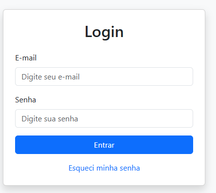

# Atividade 13 - Tela de Login com Bootstrap

**Nome do aluno:** Arthur e Alquini
**Data:** 27/04/2026

## Descrição

Desenvolvimento de uma tela de login estática utilizando o framework Bootstrap 5.  
A interface é responsiva, utiliza o sistema de grid e componentes do Bootstrap (card, form-control, button, etc.).

## Requisitos atendidos

- Formulário com campo de e-mail e senha  
- Botão de login  
- Link "Esqueci minha senha"  
- Layout responsivo (funciona bem em celular e computador)  
- Uso correto das classes do Bootstrap  
- Código HTML bem estruturado  

## Tecnologias utilizadas

- HTML5  
- Bootstrap 5.3.3  

## Como visualizar

1. Clone o repositório ou baixe o arquivo `index.html`
2. Abra o arquivo `index.html` em qualquer navegador

---

**Print da tela desenvolvida:**

